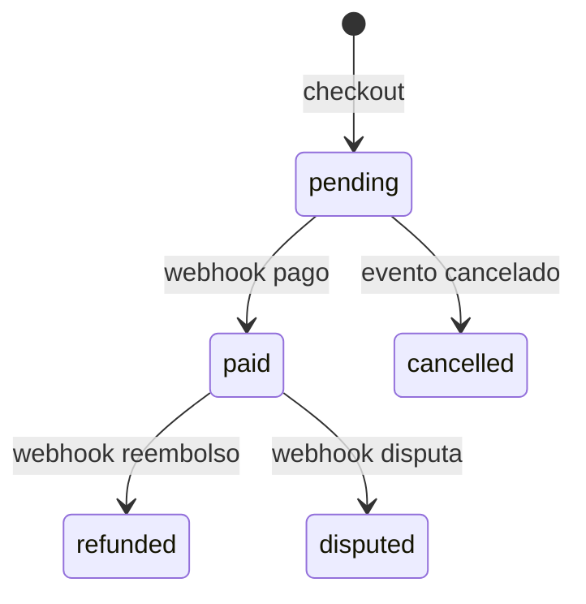
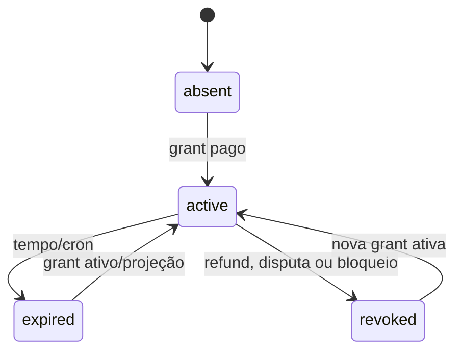

> **Status: rascunho de descoberta, não normativo, baseado no estado observado e sujeito a decisão e aprovação.**

# Entidades e estados observados

Principais tabelas: `users`, `accounts`, `sessions`, `verifications`, `profiles`; `courses`, `modules`, `lessons`, `jmvstream_*`; `orders`, `webhook_events`, `enrollment_grants`, `enrollments`, ajustes/eventos; `lesson_progress`, `lesson_watch_progress`, `certificates`, `faq_items`, `audit_logs`, `app_settings`. Fonte: `src/db/schema.ts:109-730`.

Relações/integridade: um profile por user; uma enrollment por user+course (`schema.ts:367-393`); um grant por pedido fonte (`:396-435`); uma conclusão por user+lesson (`:508-528`); um certificado por user+course e código único (`:669-694`); chave única de webhook `(provider,event_key)` (`:647-667`). Dados pessoais observados: nome, e-mail, telefone, IP/user-agent de sessão, conteúdo de suporte, compras e snapshots de certificado.

Estados confirmados:

- Conteúdo: `draft`, `active`, `archived`; cursos/módulos/aulas usam esse enum.
- Pedido: `pending`, `paid`, `refunded`, `disputed`, `cancelled`; webhook: `received`, `processed`, `ignored`, `failed`.
- Grant: `active`, `expired`, `refunded`, `disputed`, `cancelled`; enrollment: `active`, `expired`, `revoked`.
- Vídeo: upload `uploading|processing|ready|failed`; exclusão `none|pending|deleted|failed`.
- Progresso: inexistente para concluído; watch progress acumula posição máxima.
- Certificado: somente emitido. Não há estado/revogação.

Lifecycles inferidos: webhook pago cria/atualiza pedido, grant e projeção; refund/disputa revoga grant e reconstrói projeção. Certificado usa snapshots de nome/título/carga, preservando emissão mesmo que conteúdo atual mude. Não existe versionamento de curso, aula opcional, lifecycle de conta ou retenção/exclusão formal observável.

## Relacionamentos, ownership e dados pessoais

| Entidade | Ownership/relacionamento | Dados pessoais e retenção aparente |
| --- | --- | --- |
| `users`/`profiles` | perfil pertence a um usuário; users são referência de auth | nome, e-mail, telefone, bloqueio; sem política de retenção |
| `sessions`/`accounts`/`verifications` | Better Auth → user; deleção de user propaga em parte | token, IP, user agent e credenciais hash; expiração de reset é modelada |
| conteúdo | curso → módulos → aulas | conteúdo editorial; exclusão de curso cascata para módulos/aulas |
| `orders` | curso e usuário opcional | e-mail/nome de compra, recibo, valor; sem retenção definida |
| grants/enrollments | user+course; grant nasce de order | eventos e motivos operacionais; ajustes preservam ator quando possível |
| progresso | user+aula | hábito/aprendizagem da aluna; aula deletada cascata progresso |
| certificados | user+course e snapshots | nome e histórico público; sem revogação/anonimização |
| comentários/suporte | comentários têm autor; suporte não persiste ticket | corpo do comentário e e-mail de suporte podem conter PII livre |
| `audit_logs` | ator/objeto | metadata livre; sem retenção ou catálogo de campos |

## Máquinas de estado preliminares

O diagrama é apenas o enum de pedido. A ordem é aplicada logicamente em execução serial, mas não possui garantia de serialização entre eventos diferentes.

As transições `revoked → active` por nova grant e o efeito de bloqueio manual são comportamento observado, não decisão de produto aprovada.
