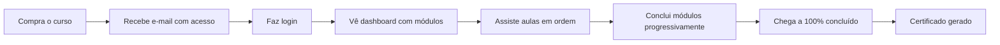

> **Status: visão inicial/histórica, não normativa.** Alguns provedores, tabelas e fluxos descritos abaixo não representam o AS-IS. A fonte de descoberta atual é `docs/business-rules/discovery/`; não use este arquivo como contrato de schema, integrações ou regras vigentes.

# PROTEA-R — Arquitetura da Área do Aluno

## 1. Visão geral do projeto

O **Sistema PROTEA-R — Área do Aluno** é uma plataforma de ensino online voltada ao curso PROTEA-R, destinado a **psicólogas e neuropsicólogas**.

A proposta central é permitir que a aluna, após realizar a compra, tenha acesso a uma área restrita onde poderá:

- Fazer login com e-mail e senha.
- Assistir às aulas organizadas por módulos.
- Avançar progressivamente pelo conteúdo.
- Acompanhar seu progresso em porcentagem.
- Receber um certificado em PDF ao concluir 100% do curso.
- Acessar suporte, FAQ e novos cursos disponíveis.

---

## 2. Perfis de acesso

| Perfil | Quem é | Permissões / Ações principais |
|---|---|---|
| **Admin / Gestora** | Equipe responsável pela gestão da plataforma | Cadastrar alunos, gerenciar módulos e aulas, liberar acesso após pagamento, acompanhar progresso e emitir certificados. |
| **Aluno / Psicóloga Participante** | Pessoa que comprou o curso e tem acesso ao conteúdo | Acessar via login único, assistir aulas por módulo, acompanhar progresso em %, acessar suporte e FAQ, receber certificado ao final. |
| **Visitante / Interessada** | Pessoa que ainda não tem conta ou não comprou curso | Ver página de vendas, realizar compra e receber acesso por e-mail. Não acessa o conteúdo restrito. |

---

## 3. Estrutura de conteúdo

### 3.1 Curso principal

**Curso:** Sistema PROTEA-R  
**Formato:** 6 módulos, 24 aulas  
**Tema:** Avaliação de suspeita de TEA

| Módulo | Tema | Duração aproximada |
|---|---:|---:|
| **Módulo 1** | Apresentação e Introdução | ~50 min |
| **Módulo 2** | Fundamentos Teóricos | ~80 min |
| **Módulo 3** | Entrevista de Anamnese | ~110 min |
| **Módulo 4** | Observação e Protocolo | ~120 min |
| **Módulo 5** | Codificação e Interpretação | ~100 min |
| **Módulo 6** | Devolutiva aos Responsáveis | ~60 min |

### 3.2 O que cada módulo / aula contém

Cada aula deve conter:

- Vídeo da professora em player embutido.
- Título da aula.
- Módulo ao qual pertence.
- Duração estimada em minutos.
- Status da aula:
  - Em andamento.
  - Próxima.
  - Bloqueada.
- Botão para marcar aula como concluída.
- Progresso por módulo, com base nas aulas concluídas.
- Barra de progresso geral do curso em porcentagem.

---

## 4. Páginas e telas do sistema

### 4.1 Área do aluno

| Tela | Descrição |
|---|---|
| **Login** | Tela dividida com imagem da professora e formulário. Acesso por e-mail e senha. |
| **Dashboard / Início** | Exibe barra de progresso, banner do curso, botão de continuar assistindo e lista de todos os módulos. |
| **Aula / Player** | Página de aula com vídeo em destaque, título, módulo, duração e botão para concluir aula. |
| **Certificado** | Gerado automaticamente ao concluir 100% do curso, com opção de download em PDF. |

### 4.2 Suporte e extras

| Tela / Recurso | Descrição |
|---|---|
| **Suporte ao aluno** | Canal direto de contato com a equipe, via WhatsApp ou formulário. |
| **Perguntas frequentes / FAQ** | Acordeon com dúvidas técnicas, de conteúdo e de acesso. |
| **Vitrine de novos cursos** | Cards de cursos lançados dentro da área do aluno. Ao clicar, a aluna é redirecionada para a página de compra. |
| **Liberação de curso comprado** | Após uma nova compra, o curso aparece automaticamente na área da aluna. |

---

## 5. Fluxo principal do aluno



### Fluxo descrito em etapas

1. Visitante compra o curso.
2. Sistema envia e-mail com acesso.
3. Aluna faz login.
4. Aluna acessa o dashboard com módulos.
5. Aluna assiste às aulas na ordem definida.
6. Sistema registra o progresso da aluna.
7. Ao concluir todas as aulas, o curso chega a 100%.
8. Sistema gera o certificado automaticamente.

---

## 6. Regras de negócio principais

| Regra | Descrição | Impacto no sistema |
|---|---|---|
| **Desbloqueio sequencial** | Módulos e aulas desbloqueiam conforme a aluna avança. Não é possível pular aulas sem concluir as anteriores. | Exige controle de progresso por aula e validação antes de liberar a próxima aula. |
| **Emissão automática de certificado** | Ao marcar a última aula como concluída, o sistema gera e disponibiliza o certificado com nome e data. | Exige regra de conclusão 100%, geração de PDF e armazenamento do arquivo. |
| **Vitrine integrada de novos cursos** | A aluna vê outros cursos dentro da área. Ao comprar, o novo curso é adicionado automaticamente à sua conta. | Exige catálogo de cursos, integração com pagamento e liberação automática via webhook. |

---

## 7. Banco de dados — tabelas principais

### 7.1 Usuários e acesso

| Tabela | Campos principais | Finalidade |
|---|---|---|
| **users** | `id`, `name`, `email`, `password_hash`, `created_at` | Armazena dados das alunas e usuários do sistema. |
| **enrollments** | `id`, `user_id`, `course_id`, `status`, `enrolled_at` | Controla matrículas e acessos a cursos. |
| **password_resets** | `id`, `user_id`, `token`, `expires_at`, `created_at` | Armazena tokens de recuperação de senha. |

### 7.2 Conteúdo

| Tabela | Campos principais | Finalidade |
|---|---|---|
| **courses** | `id`, `name`, `description`, `thumbnail`, `status` | Armazena os cursos disponíveis. |
| **modules** | `id`, `course_id`, `title`, `order`, `color` | Organiza os módulos dentro de cada curso. |
| **lessons** | `id`, `module_id`, `title`, `video_url`, `duration`, `order` | Armazena as aulas de cada módulo. |

### 7.3 Progresso

| Tabela | Campos principais | Finalidade |
|---|---|---|
| **lesson_progress** | `id`, `user_id`, `lesson_id`, `completed`, `completed_at` | Registra quais aulas foram concluídas por cada aluna. |
| **certificates** | `id`, `user_id`, `course_id`, `issued_at`, `pdf_url` | Registra certificados emitidos e seus arquivos em PDF. |

### 7.4 Suporte

| Tabela | Campos principais | Finalidade |
|---|---|---|
| **faq_items** | `id`, `question`, `answer`, `order`, `category` | Armazena perguntas frequentes. |
| **support_tickets** | `id`, `user_id`, `message`, `status`, `created_at` | Armazena solicitações de suporte feitas pelas alunas. |

---

## 8. Stack técnica apresentada no documento

| Camada | Opções citadas |
|---|---|
| **Frontend atual** | HTML + CSS + JavaScript |
| **Tipografia** | Lexend Deca |
| **Paleta visual** | Teal / Laranja |
| **Backend** | Node.js ou PHP |
| **Banco de dados** | MySQL ou PostgreSQL |
| **Vídeo** | Vimeo ou Panda Video |
| **Autenticação** | JWT ou sessão |
| **PDF / Certificados** | Puppeteer ou html2pdf |
| **E-mail transacional** | Resend ou SendGrid |
| **Pagamento** | Hotmart ou Kiwify |

---

## 9. Roadmap de desenvolvimento

### Fase 1 — MVP funcional

Objetivo: entregar a base funcional da área do aluno.

Funcionalidades previstas:

- Login e autenticação.
- Dashboard com módulos e progresso.
- Player de vídeo por aula.
- Marcação de aula concluída.
- Desbloqueio sequencial de aulas.

### Fase 2 — Experiência completa

Objetivo: melhorar a experiência da aluna e automatizar recursos complementares.

Funcionalidades previstas:

- Suporte ao aluno via formulário ou WhatsApp.
- FAQ com acordeon.
- Vitrine de novos cursos.
- Liberação automática de curso após compra via webhook.
- Certificado em PDF.

### Fase 3 — Admin e escala

Objetivo: dar autonomia operacional à equipe e preparar o sistema para mais cursos.

Funcionalidades previstas:

- Painel admin para gerenciar alunos, aulas e matrículas.
- Relatório de progresso por turma.
- Envio automático de e-mail de boas-vindas.
- Envio automático de e-mail de conclusão.
- Suporte a múltiplos cursos simultâneos.

---

# 10. Veredito sobre o documento

## 10.1 O que entendi do projeto

O documento descreve uma **plataforma de ensino online focada inicialmente em um curso específico**, o PROTEA-R. A prioridade é criar uma área do aluno simples, controlada e progressiva, onde a aluna compra o curso, recebe acesso, assiste às aulas em sequência, acompanha o progresso e recebe um certificado ao final.

A arquitetura proposta é pragmática: começa com uma área do aluno funcional, depois adiciona recursos de experiência e automação, e só na terceira fase avança para uma administração mais completa e escalável.

Em resumo, o sistema não está sendo desenhado inicialmente como um marketplace ou LMS complexo. Ele está mais próximo de uma **plataforma proprietária de curso online**, com foco em controle de acesso, vídeo, progresso, certificado e suporte.

---

## 10.2 Pontos fortes

1. **Escopo inicial bem definido**  
   A proposta evita começar grande demais. O MVP foca no essencial: login, aulas, progresso e desbloqueio sequencial.

2. **Boa separação entre aluno, visitante e admin**  
   Os perfis estão claros e ajudam a orientar permissões, telas e regras de acesso.

3. **Roadmap coerente**  
   As fases seguem uma lógica saudável: primeiro funcionamento, depois experiência, depois escala.

4. **Modelo de dados inicial suficiente**  
   As tabelas principais cobrem usuários, cursos, módulos, aulas, progresso, certificados, FAQ e suporte.

5. **Boa preocupação com progressão e certificado**  
   O desbloqueio sequencial e a emissão automática de certificado são regras importantes para dar estrutura e valor percebido ao curso.

---

## 10.3 Pontos que eu melhoraria

### 1. Trazer um painel admin mínimo já para a Fase 1

No documento, o painel admin completo aparece apenas na Fase 3. Isso faz sentido para escala, mas algum nível de administração precisa existir já no MVP.

Mesmo que seja simples, a equipe precisa conseguir:

- Cadastrar ou editar alunas.
- Liberar acesso manualmente em casos excepcionais.
- Visualizar matrículas.
- Ver progresso básico.
- Editar dados de cursos, módulos e aulas, ou pelo menos gerenciá-los de forma segura.

**Sugestão:** dividir em dois níveis:

- **Admin mínimo — Fase 1:** gestão essencial de alunos, matrículas e conteúdo.
- **Admin avançado — Fase 3:** relatórios, turmas, automações, múltiplos cursos e recursos de escala.

---

### 2. Definir a stack final antes de desenvolver

O documento ainda deixa muitas decisões abertas: Node.js ou PHP, MySQL ou PostgreSQL, JWT ou sessão, Vimeo ou Panda Video, Hotmart ou Kiwify.

Isso é normal em uma etapa inicial, mas antes do desenvolvimento é importante fechar essas escolhas para evitar retrabalho.

Minha leitura:

- Se a equipe já trabalha com JavaScript/TypeScript, faz mais sentido ir para **Node.js / Next.js**.
- Para banco, eu tenderia a escolher **PostgreSQL**, por ser robusto, flexível e ótimo para aplicações SaaS ou sistemas que podem crescer.
- Para autenticação de área logada tradicional, eu tenderia a usar **sessão/cookie seguro** em vez de JWT puro no navegador.
- Para vídeos, eu não hospedaria diretamente. Usaria **Panda Video ou Vimeo**, com proteção de domínio e embed privado sempre que possível.
- Para e-mails, **Resend ou SendGrid** resolvem bem o envio transacional.
- Para pagamento, **Hotmart ou Kiwify** podem funcionar bem se a estratégia for vender curso digital com checkout externo e webhook de liberação.

---

### 3. Detalhar melhor segurança, LGPD e controle de acesso

Como o curso é voltado a profissionais da saúde, é importante ter cuidado com dados pessoais, acesso indevido e exposição de conteúdo.

Eu incluiria no documento uma seção específica para:

- Política de senha.
- Recuperação de senha.
- Sessões ativas.
- Permissões por perfil.
- Proteção de rotas.
- Logs de ações administrativas.
- Termos de uso e política de privacidade.
- Tratamento de dados pessoais conforme LGPD.
- Proteção contra compartilhamento indevido de acesso.

---

### 4. Melhorar o modelo de pagamentos e webhooks

A liberação automática via webhook é um ponto sensível. O documento cita a regra, mas ainda não detalha o funcionamento.

Eu adicionaria:

- Tabela de compras/pedidos.
- Tabela de eventos de webhook recebidos.
- Controle de status do pagamento.
- Verificação de assinatura do webhook.
- Idempotência, para não liberar o mesmo curso duas vezes.
- Tratamento de reembolso, chargeback e cancelamento.
- Registro de erros de integração.

Tabelas sugeridas:

```text
orders
- id
- user_id
- course_id
- provider
- provider_order_id
- status
- paid_at
- refunded_at
- created_at

webhook_events
- id
- provider
- event_id
- payload
- processed_at
- status
- created_at
```

---

### 5. Criar validação de certificado

O certificado em PDF é uma boa entrega, mas pode ficar mais profissional se tiver algum meio de validação.

Sugestão:

- Código único do certificado.
- URL pública de validação.
- QR Code no PDF.
- Registro do nome da aluna, curso, carga horária e data de emissão.

Exemplo de campos extras em `certificates`:

```text
certificates
- id
- user_id
- course_id
- code
- issued_at
- pdf_url
- validation_url
```

---

### 6. Definir melhor a regra de progresso

O documento fala em marcar aula como concluída, mas seria importante decidir se a conclusão depende apenas do clique da aluna ou se há algum controle de vídeo assistido.

Opções possíveis:

- Concluir manualmente ao clicar no botão.
- Liberar conclusão apenas após determinado percentual do vídeo assistido.
- Permitir conclusão manual, mas registrar tempo assistido.
- Bloquear próxima aula até a anterior estar concluída.

Para MVP, o clique manual pode ser suficiente. Para uma versão mais robusta, registrar tempo assistido melhora controle e credibilidade.

---

### 7. Separar conteúdo, matrícula e progresso de forma mais explícita

A base já está boa, mas eu reforçaria três conceitos:

- **Conteúdo:** cursos, módulos e aulas.
- **Matrícula:** relação entre aluna e curso.
- **Progresso:** relação entre aluna e aula.

Essa separação evita problemas quando houver múltiplos cursos, novas turmas ou reedições do mesmo curso.

---

### 8. Planejar suporte de forma simples no início

O documento prevê suporte via WhatsApp ou formulário. Para o MVP, eu escolheria o caminho mais simples:

- Botão direto para WhatsApp.
- FAQ básica.
- Formulário interno apenas se houver necessidade real de histórico.

Criar um sistema completo de tickets logo no início pode ser mais do que o necessário.

---

## 10.4 Veredito final

O documento é um **bom ponto de partida para transformar a ideia em produto**. Ele define bem a proposta, os perfis, as telas principais, a lógica de progressão, o banco de dados inicial e um roadmap simples.

Minha avaliação: **a arquitetura está correta para uma primeira versão**, mas ainda está mais próxima de um **documento de visão técnica e escopo inicial** do que de uma arquitetura pronta para desenvolvimento.

Antes de começar a programar, eu refinaria principalmente:

1. Stack final.
2. Admin mínimo no MVP.
3. Regras de pagamento e webhook.
4. Segurança e LGPD.
5. Geração e validação de certificados.
6. Regras exatas de progresso e desbloqueio.
7. Critérios objetivos de cada fase do roadmap.

Com esses ajustes, o projeto fica bem mais seguro, mais claro para orçamento e mais fácil de desenvolver sem retrabalho.

---

# 11. Roadmap refinado sugerido

## Fase 0 — Decisões e preparação

Antes do desenvolvimento:

- Fechar stack final.
- Definir provedor de vídeo.
- Definir gateway/plataforma de pagamento.
- Definir modelo de autenticação.
- Definir estrutura real do curso.
- Definir identidade visual da plataforma.
- Definir regras de certificado.
- Definir termos de uso e privacidade.

## Fase 1 — MVP utilizável

- Login.
- Dashboard do aluno.
- Player de aula.
- Lista de módulos e aulas.
- Progresso por aula.
- Desbloqueio sequencial.
- Certificado básico em PDF.
- Admin mínimo para alunos, matrículas e conteúdo.
- Liberação manual de acesso, se a integração de pagamento ainda não estiver pronta.

## Fase 2 — Automação e experiência

- Integração com pagamento via webhook.
- E-mail automático de boas-vindas.
- E-mail automático de conclusão.
- FAQ.
- Suporte via WhatsApp ou formulário.
- Vitrine de novos cursos.
- Certificado com código de validação.

## Fase 3 — Escala

- Múltiplos cursos simultâneos.
- Relatórios por turma.
- Gestão avançada de alunos.
- Histórico de compras.
- Logs administrativos.
- Melhorias de segurança.
- Área de gestão de conteúdo mais completa.

---

# 12. Conclusão

A proposta é viável, tem escopo inicial controlado e pode ser desenvolvida de forma relativamente rápida se as decisões técnicas forem fechadas antes do início.

O maior risco não está na complexidade da área do aluno em si, mas nas integrações e regras ao redor dela: pagamento, liberação automática, proteção de vídeo, certificado, suporte e administração.

Se o objetivo for lançar rápido, eu começaria com um MVP simples, com liberação manual ou semi-automática, admin mínimo e foco total na experiência da aluna. Depois, com uso real, entraria a automação via webhook, vitrine de cursos e relatórios mais completos.
